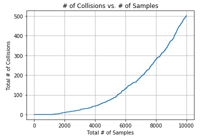

# Bloom Filtering

In data streaming, we may need to apply some filtering process to accept some elements that meet a criterion.
Rejected elements are dropped whereas accepted elements are proceeded to the stream.

For the case of Bloom Filtering, the criterion is to lookup for a membership of a set.
Bloom filters eliminate most of the elements that are not in the set and rejected elements are certainly not in the set.
In other words, the false negative is always 0 whereas bloom filters can only say the element is "maybe" in the set.

### The Notebook

See [bloom-filter.ipynb](bloom-filter.ipynb).

### Procedure
1. Init the array of bits a, initially all 0.
2. Set 2 hash functions h1(x), h2(x).
3. ones(x) gives the the # of bits in the binary representation of x.
4. zeros(x) gives the the # of bits in the binary representation of x
5. For element el to be added to the set,
    - a[h1(zeros(el))] = 1
    - a[h2(ones(el)) = 1
6. To check whether an element might be in the set,
    - a[h1(zeros(el))] == 1 and a[h2(ones(el)) == 1
7. To check whether an element is not in the set,
    - not (a[h1(zeros(el))] == 1 and a[h2(ones(el)) == 1)

More general version of the bloom filtering can be found on the book below in references section.

### Analysis
For bit array with length 2^16, when distinct random samples are introduced and tested to the bloom filter we obtain the following plot:

### References
Leskovec, J., Rajaraman, A. and Ullman, J. (2016). Mining of massive datasets. Delhi: Cambridge University Press, pp.140-141.
